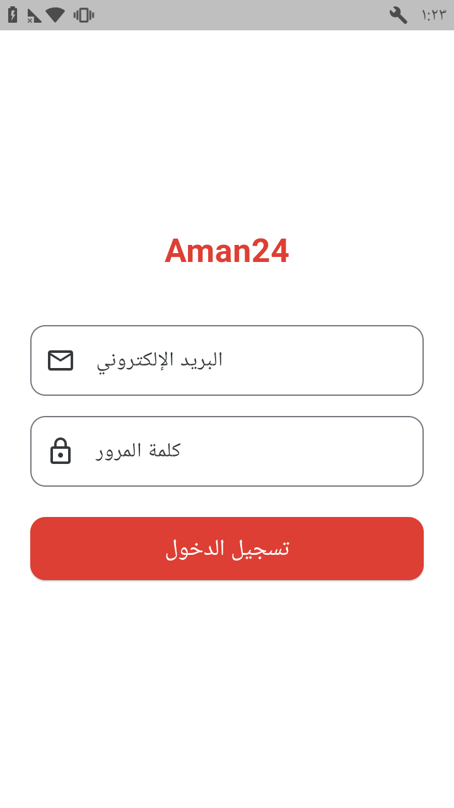
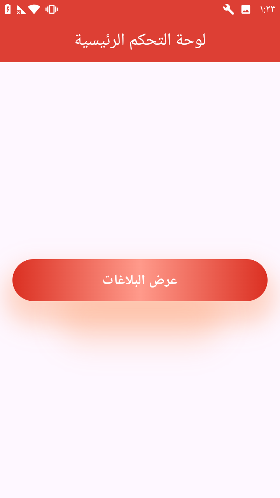
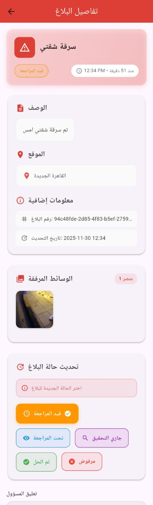
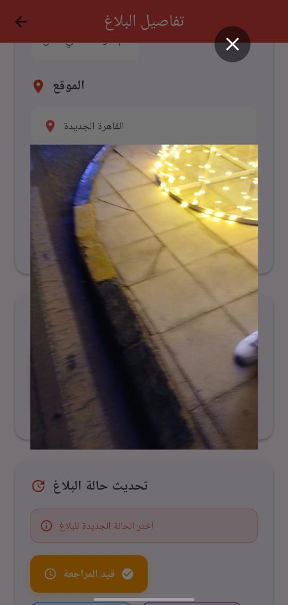
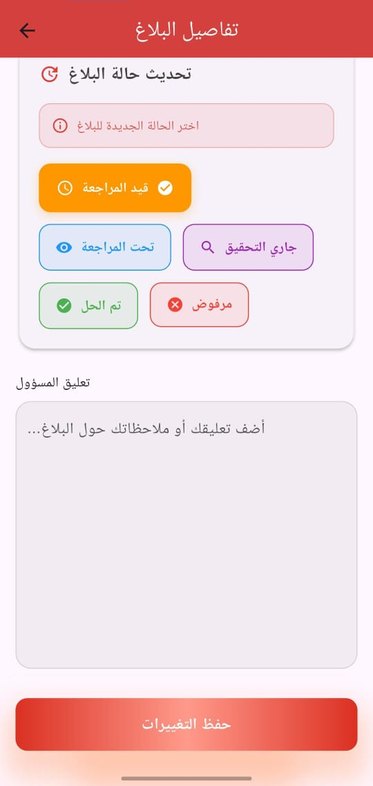
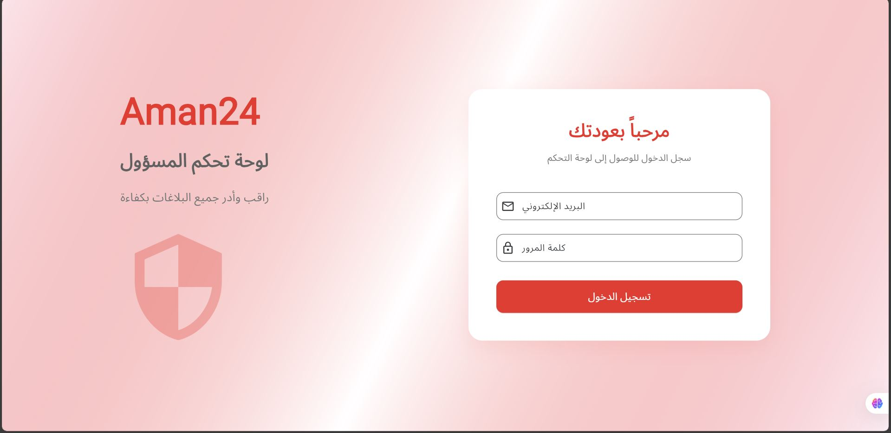
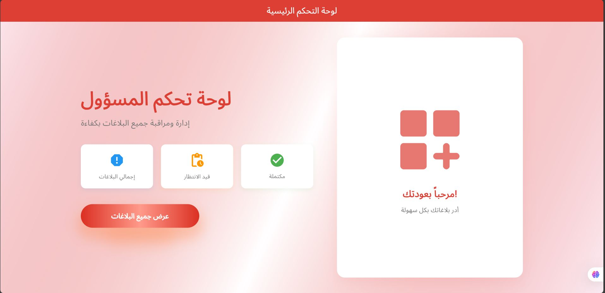
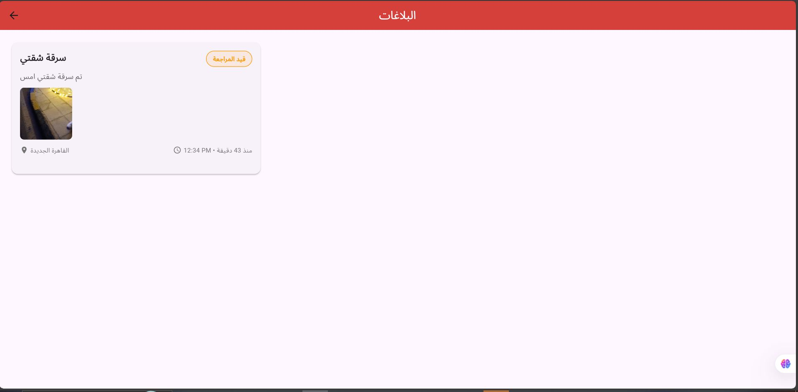
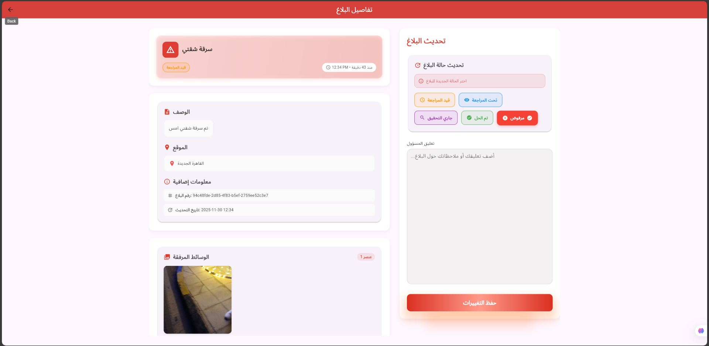

# Aman24 Admin Dashboard 🛡️

A comprehensive Flutter-based admin dashboard for managing and monitoring reports in the Aman24 safety application. This dashboard provides administrators with powerful tools to review, update, and respond to user-submitted reports efficiently.

**🌐 Live Demo:** [https://depi-project-1dda8.web.app/](https://depi-project-1dda8.web.app/)

**🎨 Design Files:**
- [Web Design (Figma)](https://www.figma.com/board/ZjB1C7mrSYqjQIAZ4DSfUe/aman24-admin?node-id=5-399&p=f&t=G306tKHBMfNCYglK-0)
- [Mobile Design (Figma)](https://www.figma.com/design/7GzbmGkDuPfor7i3Jcp4um/Admin-Dashboard?node-id=0-1&p=f&m=dev)

## 📋 Table of Contents

- [Features](#-features)
- [Screenshots](#-screenshots)
- [Tech Stack](#️-tech-stack)
- [Architecture](#️-architecture)
- [Getting Started](#-getting-started)
- [Project Structure](#-project-structure)
- [Firebase Configuration](#-firebase-configuration)
- [CI/CD](#-cicd)
- [Build & Release](#-build--release)
- [Contributing](#-contributing)

## ✨ Features

### Core Functionality
- **🔐 Admin Authentication**: Secure Firebase authentication for admin access
- **📊 Report Management**: View and manage all user-submitted reports
- **📝 Report Details**: Comprehensive view of individual reports with full media support
- **💬 Admin Comments**: Add administrative notes and feedback to reports
- **🔄 Status Updates**: Change report status (Pending, In Progress, Resolved, Rejected)
- **🖼️ Media Gallery**: View images and videos associated with reports
- **📱 Responsive Design**: Optimized layouts for mobile and web platforms
- **🌐 Multi-Platform**: Runs seamlessly on Android, iOS, and Web

### Admin Capabilities
- Real-time report updates via Firebase Firestore
- Full-screen media viewer for detailed inspection
- Video playback support for multimedia reports
- Report timestamp tracking
- Location/address information display

## 📸 Screenshots

### Mobile Version

<table>
  <tr>
    <td></td>
    <td></td>
    <td></td>
  </tr>
  <tr>
    <td align="center"><b>Login Screen</b></td>
    <td align="center"><b>Home Screen</b></td>
    <td align="center"><b>Reports List</b></td>
  </tr>
  <tr>
    <td></td>
    <td></td>
    <td></td>
  </tr>
  <tr>
    <td align="center"><b>Report Details</b></td>
    <td align="center"><b>Media Preview</b></td>
    <td align="center"><b>Admin Comments</b></td>
  </tr>
</table>

### Web Version

<table>
  <tr>
    <td></td>
    <td></td>
  </tr>
  <tr>
    <td align="center"><b>Web Sign In</b></td>
    <td align="center"><b>Web Home Dashboard</b></td>
  </tr>
  <tr>
    <td></td>
    <td></td>
  </tr>
  <tr>
    <td align="center"><b>Web Reports View</b></td>
    <td align="center"><b>Web Report Details</b></td>
  </tr>
</table>

## 🛠️ Tech Stack

### Framework & Language
- **Flutter 3.32.8** - Cross-platform UI framework
- **Dart 3.8.1+** - Programming language

### State Management
- **flutter_bloc 9.1.1** - BLoC pattern implementation
- **Cubit** - Simplified BLoC for state management

### Backend & Database
- **Firebase Core 3.15.2** - Firebase initialization
- **Firebase Auth 5.2.1** - Authentication service
- **Cloud Firestore 5.4.2** - Real-time NoSQL database

### UI & Media
- **cupertino_icons 1.0.8** - iOS-style icons
- **awesome_snackbar_content 0.1.7** - Beautiful notifications
- **skeletonizer 2.1.0** - Loading state UI
- **image_picker 1.2.0** - Media selection
- **video_player 2.9.2** - Video playback

### Utilities
- **get_it 9.0.5** - Dependency injection
- **shared_preferences 2.5.3** - Local storage
- **dartz 0.10.1** - Functional programming utilities

### Development Tools
- **flutter_lints 5.0.0** - Code analysis
- **flutter_launcher_icons 0.14.4** - App icon generator

## 🏗️ Architecture

This project follows **Clean Architecture** principles with clear separation of concerns:

```
lib/
├── core/                       # Shared utilities and services
│   ├── entities/              # Domain entities
│   ├── enums/                 # App-wide enumerations
│   ├── errors/                # Error handling
│   ├── helpers/               # Helper functions
│   ├── models/                # Data models
│   ├── services/              # Core services (Firebase, Storage, etc.)
│   ├── utils/                 # Utilities and constants
│   └── widgets/               # Reusable widgets
│
├── features/                   # Feature modules
│   ├── auth/                  # Authentication feature
│   │   └── presentation/      # UI layer
│   │       └── views/         # View screens
│   │
│   └── home/                  # Home/Reports feature
│       ├── data/              # Data layer
│       │   └── repos/         # Repository implementations
│       ├── domain/            # Domain layer
│       │   └── repos/         # Repository interfaces
│       └── presentation/      # Presentation layer
│           ├── manager/       # State management (Cubits)
│           ├── views/         # View screens
│           └── widgets/       # Feature-specific widgets
│
├── app_theme.dart             # App theming
├── firebase_options.dart      # Firebase configuration
└── main.dart                  # App entry point
```

### Design Patterns Used
- **BLoC/Cubit Pattern** - State management
- **Repository Pattern** - Data abstraction
- **Dependency Injection** - Using GetIt
- **Observer Pattern** - Custom BLoC observer

## 🚀 Getting Started

### Prerequisites

- Flutter SDK 3.32.8 or higher
- Dart SDK 3.8.1 or higher
- Android Studio / VS Code
- Firebase account
- Git

### Installation

1. **Clone the repository**
   ```bash
   git clone https://github.com/peterelia22/Admin_Dashoard.git
   cd admin_dashboard
   ```

2. **Install dependencies**
   ```bash
   flutter pub get
   ```

3. **Configure Firebase**
   - Create a new Firebase project
   - Enable Authentication (Email/Password)
   - Enable Cloud Firestore
   - Download `google-services.json` for Android and place it in `android/app/`
   - Download `GoogleService-Info.plist` for iOS and place it in `ios/Runner/`
   - Run FlutterFire CLI to generate configuration:
     ```bash
     flutterfire configure
     ```

4. **Generate app icons** (optional)
   ```bash
   flutter pub run flutter_launcher_icons
   ```

5. **Run the app**
   ```bash
   # For development
   flutter run

   # For specific platform
   flutter run -d chrome        # Web
   flutter run -d android        # Android
   flutter run -d ios            # iOS (macOS only)
   ```

### Build for Production

#### Android APK
```bash
flutter build apk --release
```

#### Android App Bundle
```bash
flutter build appbundle --release
```

#### iOS
```bash
flutter build ios --release
```

#### Web
```bash
flutter build web --release
```

## 📁 Project Structure

### Key Directories

- **`lib/core/`** - Contains shared code used across the application
  - `entities/` - Business entities
  - `models/` - Data models with JSON serialization
  - `services/` - Firebase and other service integrations
  - `helpers/` - Utility functions and helpers

- **`lib/features/`** - Feature-based modules
  - Each feature follows Clean Architecture layers
  - Separated by data, domain, and presentation concerns

- **`assets/`** - Static assets (images, fonts, etc.)

- **`screenshots/`** - Application screenshots for documentation

## 🔥 Firebase Configuration

### Firestore Collections

**Reports Collection**: `reports`
```json
{
  "reportId": "string",
  "title": "string",
  "description": "string",
  "userId": "string",
  "status": "pending|inProgress|resolved|rejected",
  "mediaUrls": ["string"],
  "address": "string",
  "adminComment": "string",
  "createdAt": "timestamp",
  "updatedAt": "timestamp"
}
```

### Authentication
- Firebase Authentication with Email/Password provider
- Admin users must be manually added to Firebase Auth

### Security Rules
Make sure to configure appropriate Firestore security rules to restrict access to admin users only.

## 🔄 CI/CD

The project includes automated CI/CD workflows using GitHub Actions:

### 1. **Build & Release APK** (`.github/workflows/release.yml`)
- Triggers on push to `main` branch
- Builds release APK
- Creates GitHub release with auto-incrementing version
- Uploads APK as release asset

### 2. **Firebase Deployment** (`.github/workflows/firebase_deploy.yml`)
- Deploys web build to Firebase Hosting
- Automated deployment pipeline

### Setting Up CI/CD

1. Add `GH_PAT` (GitHub Personal Access Token) to repository secrets
2. Configure Firebase CLI for deployment
3. Push to main branch to trigger workflows

## 📦 Build & Release

### Version Management
Version format: `1.0.0+1`
- Major.Minor.Patch+BuildNumber
- Automatically incremented by CI/CD pipeline

### Release Process
1. Commit changes to `main` branch
2. GitHub Actions automatically:
   - Builds release APK
   - Creates new release tag
   - Uploads artifacts
3. Releases are available in GitHub Releases section

## 🤝 Contributing

Contributions are welcome! Please follow these steps:

1. Fork the repository
2. Create a feature branch (`git checkout -b feature/AmazingFeature`)
3. Commit your changes (`git commit -m 'Add some AmazingFeature'`)
4. Push to the branch (`git push origin feature/AmazingFeature`)
5. Open a Pull Request

### Code Style
- Follow Flutter/Dart style guidelines
- Use meaningful variable and function names
- Add comments for complex logic
- Ensure all tests pass before submitting PR

## 📄 License

This project is part of the DEPI (Digital Egypt Pioneers Initiative) program.

## 🙏 Acknowledgments

- Digital Egypt Pioneers Initiative (DEPI)
- Flutter and Firebase teams for excellent frameworks
- All contributors and testers

## 📞 Support

For support, please open an issue in the GitHub repository or contact the development team.

---

**Made with ❤️ for Aman24 Safety Platform**
